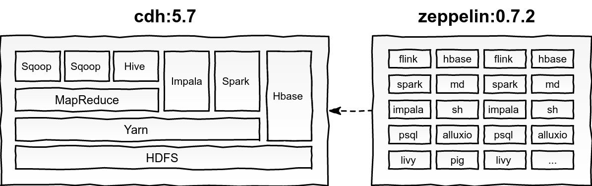

# Docker - CDH e Zeppelin

Ambiente integra do entre o Cloudera quickstart 5.7 e Apache Zeppelin 0.7.2 usando docker e docker-compose.



**Clone do projeto**

```
git clone https://github.com/sebagonella/docker-cdh-zeppelin.git
```

**Build do ambiente**

```
$ cd docker-cdh-zeppelin
$ docker-compose build
```

**Subindo o ambiente**

Subindo os dois containers em background.

```
$ docker-compose up -d
```

Subindo apenas o Zeppelin em background

```
$ docker-compose up -d zeppelin
```

Subindo apenas o Cloudera em background.

```
$ docker-compose up -d quickstart.cloudera
```

### Cloudera quickstart

O container do Cloudera quickstart já está com o drive jdbc do DB2 para uso com Sqoop, Spark ou outro necessário.

**ResourceManager**  
http://localhost:8088

**Hue**  
http://localhost:8888  
user: cloudera  
pass: cloudera  
  
Tamanho da imagem após build: 6.46GB

**Exemplo - Obtendo dados do DB2 com Sqoop**

```
sqoop import --driver com.ibm.db2.jcc.DB2Driver --connect jdbc:db2://server:port/database --username XXXXX --password XXXXX --table schema.tablename --split-by idtable --target-dir /tmp/table_name
```

### Apache Zeppelin

Já o container do Zeppelin está com o jdbc do Impala, bem como o interpreter Zeppelin (tipo jdbc) integrado e configurado ao CDH. 

**Zeppelin**  
http://localhost:8081  

Tamanho da imagem após build: 3.17GB

**Exemplo - Acesssando o Impala**

```
%impala

select * from table_name;
```

O container Zeppelin está com o Spark configurado e integrado ao Yarn do CDH. Os processos submetidos no Spark (Spark, SparkR, PySpark, SparkSQL...) serão executados no Spark do CDH com Yarn.

**Exemplo - Salvando dados no HDFS com PySpark**

```
%pyspark

df = sc.parallelize((("a", 1), ("b", 2))).toDF()

df.write.save('hdfs://cloudera.quickstart:8020/tmp/TestHDFS5', mode='append')
```

**Interpreters disponíveis no Zeppelin**

* flink
* spark 
* impala (jdbc)
* psql
* livy
* hbase
* md
* sh
* alluxio
* pig
* bigquery
* cassandra
* lens
* hdfs
* jdbc
* ignite
* angular
* python
* kylin