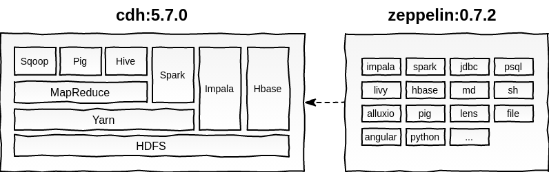

# Docker - CDH and Zeppelin

Integrated environment with Cloudera quickstart 5.7.0 and Apache Zeppelin 0.7.2 using docker and docker-compose.



**Clone the project**

```
git clone https://github.com/sebagonella/docker-cdh-zeppelin.git
```

**Build the project**

```
$ cd docker-cdh-zeppelin
$ docker-compose build
```

**Start the enviropment**

Starting containers in background

```
$ docker-compose up -d
```

Starting only Apache Zeppelin in background

```
$ docker-compose up -d zeppelin
```

Starting only Cloudera Quickstart in background

```
$ docker-compose up -d quickstart.cloudera
```

### Cloudera quickstart

The Cloudera Quickstart image already has the DB2 jdbc drive for use with Sqoop, Spark, or other required.

**Links**

ResourceManager - http://localhost:8088
Hue - http://localhost:8888  
user: cloudera  
pass: cloudera 
  
Size docker image after build: 6.46GB

**Example - Get data from DB2 to HDFS using Sqoop**

```
sqoop import --driver com.ibm.db2.jcc.DB2Driver --connect jdbc:db2://server:port/database --username XXXXX --password XXXXX --table schema.tablename --split-by idtable --target-dir /tmp/table_name
```

### Apache Zeppelin

**Links**

Zeppelin  
http://localhost:8081  

Size docker image after build: 3.17GB

**Example - Using Impala interpreter**

The Apache Zeppelin image already has the Impala jdbc drive and a interpreter configured with it (jdbc type) to execute commands in the Impala of the Cloudera Quickstart enviropment.

```
%impala

select * from table_name;
```

**Example - Using Spark in YARN mode**

This image has Zeppelin with Apache Spark configured and integrated with the Yarn of CDH.

Example - Save data on HDFS with PySpark

```
%pyspark

df = sc.parallelize((("a", 1), ("b", 2))).toDF()

df.write.save('hdfs://cloudera.quickstart:8020/tmp/TestHDFS5', mode='append')
```

**Zeppelin Interpreters**

* flink
* spark 
* impala (jdbc)
* psql
* livy
* hbase
* md
* sh
* alluxio
* pig
* bigquery
* cassandra
* lens
* hdfs
* jdbc
* ignite
* angular
* python
* kylin